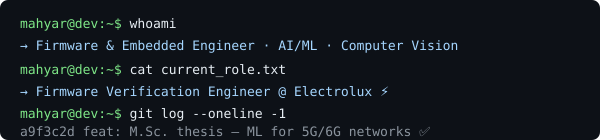

<div align="center">

</div>

<div align="center">

# Mahyar Onsori
### *// building hardware that thinks & software that ships*

[](https://www.linkedin.com/in/mahyar-onsori/)
[](https://github.com/Mahyar426)
[](mailto:mahyaronsori99@gmail.com)
[](mailto:mahyaronsori99@gmail.com)

</div>

---

## ⚡ Impact at a Glance

<div align="center">

| 🚀 65% | 👁️ 4,000 FPS | 🧪 30+ | 📡 2M+ |
|:---:|:---:|:---:|:---:|
| Firmware validation time reduced | Industrial vision pipeline throughput | Automated test scripts shipped | RTP network observations analyzed |

</div>

---

## 💼 Experience

```yaml
Current:
  role: Firmware Verification Engineer
  company: Electrolux (via Brain Technologies)
  location: Pordenone, Italy
  since: Jul 2025
  highlights:
    - Cut firmware validation time ~65% via Python/unittest automation
    - Pioneered HIL testing with J-Link for system-level firmware coverage
    - Root-cause analysis across 3+ hardware revisions

Previous:
  - Embedded Software Engineer @ Olorin S.r.l. (Turin, 2024–2025)
      → 4,000 FPS FPGA-accelerated inspection pipeline
      → Real-time multi-QR marker vision on Raspberry Pi
      → STM32 firmware for sensor acquisition + ICMP comms

  - Computer Vision Engineer @ Squadra Corse Driverless, Polito (2023–2024)
      → YOLO-based real-time cone detection for autonomous racing
```

---

## 🎓 Education

| Degree | Institution | Thesis |
|--------|------------|--------|
| **M.Sc. Communications Engineering** | Politecnico di Torino (104/110) | SVD-based edge pruning for federated ML in 5G/6G |
| **B.Sc. Electrical Engineering** | Isfahan University of Technology | Camera-only gaze estimation system — ~98% accuracy |

---

## 🛠️ Tech Stack

**Languages**


**Embedded Platforms**


**AI / ML / Vision**


**Protocols & Tools**


---

## 🚀 Noteworthy Projects

| Project | Stack | Highlight |
|---------|-------|-----------|
| 👁️ **[Eye-Tracking System](https://github.com/Mahyar426/Eye-Tracking-via-Iris-Detection)** | MATLAB, Computer Vision | ~98% gaze accuracy — camera-only, zero hardware trackers |
| 🛰️ **[LEO Satellite Comms Simulator](https://github.com/Mahyar426/LEO-SatComm-Simulator)** | MATLAB, OTFS, LDPC, CCSDS | End-to-end LEO link budget + OTFS waveform + CCSDS coding |
| 📡 **[RTP Traffic Recognition](https://github.com/Mahyar426/RTP-Traffic-Pattern-Recognition)** | Python, PyTorch, scikit-learn | ML on 2M+ real network obs — loss detection, flow clustering, bitrate forecasting |
| ⚡ **[FPGA Matrix Co-Processor](https://github.com/Mahyar426/FPGA-and-Digital-Design-in-Verilog)** | Verilog, Xilinx ISE | Dual-clock UART-interfaced 32×32 matrix ALU synthesized on hardware |
| 📻 **[Advanced Wireless Comms](https://github.com/Mahyar426/Advanced-Wireless-Communications)** | MATLAB, App Designer | DS-CDMA · MIMO water-filling · SINR-constrained beamforming |
| 🔐 **[Cryptography Lab](https://github.com/Mahyar426/Breaking-Ciphers-One-Bit-at-a-Time)** | Python, CrypTool | LFSR cryptanalysis, ECDLP, Baby-Step Giant-Step — broke it then rebuilt it |
| 🛰️ **[GNSS Signal Processing](https://github.com/Mahyar426/gnss-signal-processing-labs)** | MATLAB | Full receiver chain: Android raw data → spreading codes → CAF acquisition → DLL tracking |
| 🎙️ **[Audio Beamforming](https://github.com/Mahyar426/dsp-audio-beamforming-matlab)** | MATLAB | 16-mic DAS/MVDR beamformer with real-time spatial spectrum waterfall |

---

## 📜 Publication

> **M. Onsori et al.**, *"Data-Driven and Privacy-Preserving Cooperation in Decentralized Learning"*  
> IEEE 49th Conference on Local Computer Networks (LCN), 2024

---

## 🏆 Achievements

- 🥇 **EDISU Scholarship** — Ranked 1st, Politecnico di Torino
- 🥇 **Top 1%** — National B.Sc. Entrance Exam, Iran
- 📜 **IEEE LCN 2024** — Published researcher in federated/decentralized ML

---

## 🌍 Languages


---

## ⚡ Beyond the Code

```
⚽ Football fanatic  |  🏀 Basketball follower  |  ♟️ Amateur chess player
🪗 Future accordion virtuoso  |  🎮 Pro gamer  |  🎥 Film enthusiast  |  🌍 Multicultural team lover
```

---

<div align="center">

### Let's connect and build something that matters 🚀

[](https://www.linkedin.com/in/mahyar-onsori/)
[](mailto:mahyaronsori99@gmail.com)

*`// open to collaborations · always building something · </mahyar>`*

</div>
